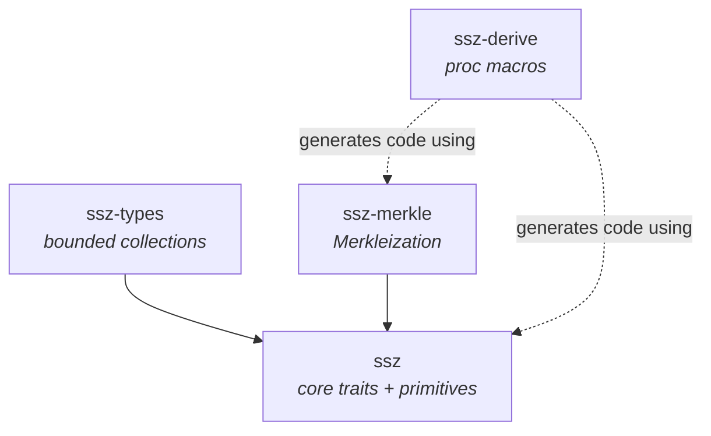

# Architecture

## Crate dependency graph



All arrows point toward dependencies. Dashed arrows indicate compile-time (proc-macro) relationships -- `ssz-derive` generates code that references types from `ssz` and `ssz-merkle`, but does not depend on them at build time.

## Crate responsibilities

### `ssz` -- core encoding/decoding

The foundation crate. Defines two traits (`SszEncode`, `SszDecode`), an error type (`DecodeError`), and helper structs for container serialization (`ContainerEncoder`, `ContainerDecoder`).

Provides implementations for:
- `bool`
- Unsigned integers: `u8`, `u16`, `u32`, `u64`, `u128`
- Fixed-size byte arrays: `[u8; 4]`, `[u8; 20]`, `[u8; 32]`, `[u8; 48]`, `[u8; 96]`
- `Vec<T>` for any `T: SszEncode` / `T: SszDecode`

Exports two constants used across the workspace:
- `BYTES_PER_LENGTH_OFFSET = 4` -- SSZ uses 4-byte little-endian offsets
- `BYTES_PER_CHUNK = 32` -- Merkle tree chunks are 32 bytes (SHA-256 digest size)

### `ssz-types` -- bounded collections

Wraps `Vec<T>` and bitfield storage in types that enforce SSZ length bounds at construction time:

| Type | SSZ concept | Constraint |
|------|-------------|------------|
| `SszVector<T, N>` | `Vector[T, N]` | Exactly `N` elements |
| `SszList<T, N>` | `List[T, N]` | At most `N` elements |
| `Bitvector<N>` | `Bitvector[N]` | Exactly `N` bits |
| `Bitlist<N>` | `Bitlist[N]` | At most `N` bits |

Uses const generics (`const N: usize`) for compile-time bounds rather than `typenum`. See [Design rationale](#why-const-generics-over-typenum) below.

### `ssz-merkle` -- Merkleization

Implements the SSZ Merkleization spec:
- `HashTreeRoot` trait for computing Merkle roots
- `merkleize` function for building Merkle trees from chunks with virtual padding
- Precomputed `ZERO_HASHES` table (generated at build time via `build.rs`) to avoid runtime recomputation
- Pack and pack-bits helpers for basic types and bitfields

### `ssz-derive` -- proc macros

Derives `SszEncode`, `SszDecode`, and `HashTreeRoot` for named-field structs. The generated code calls into `ssz` and `ssz-merkle` APIs, so users must have those crates as dependencies.

## Data flow

### Encode

```
value.to_ssz()
  |
  +-> SszEncode::ssz_append(&self, buf)
        |
        +-- fixed-size type: write bytes directly (LE for integers)
        |
        +-- variable-size type (Vec<T>):
        |     +-- fixed elements: concatenate encodings
        |     +-- variable elements: write offsets, then data
        |
        +-- container (via ContainerEncoder):
              1. append_fixed / append_variable for each field
              2. finalize(): patch offset placeholders, write fixed + variable parts
```

### Decode

```
T::from_ssz_bytes(bytes)
  |
  +-- fixed-size type: validate length, read bytes
  |
  +-- variable-size type (Vec<T>):
  |     +-- fixed elements: chunk by T::fixed_size(), decode each
  |     +-- variable elements: read offsets, validate monotonicity, slice and decode
  |
  +-- container (via ContainerDecoder):
        1. new(bytes, fixed_part_len) -- validate minimum length
        2. decode_fixed / read_variable_offset for each field (in field order)
        3. decode_variable for each variable field (in field order)
        4. finish_fixed (if all-fixed) to check for trailing bytes
```

### Merkleize

```
value.hash_tree_root()
  |
  +-- basic type: serialize to ≤32 bytes, zero-pad to 32 bytes
  |
  +-- container: hash_tree_root each field, merkleize the field roots
  |
  +-- vector/list of basic: pack elements into 32-byte chunks, merkleize
  |     +-- list: mix_in_length(merkleize(chunks, limit), length)
  |
  +-- bitvector/bitlist: pack bits into 32-byte chunks, merkleize
        +-- bitlist: mix_in_length(merkleize(chunks, limit), length)

merkleize(chunks, limit):
  1. Compute depth = ceil(log2(limit))
  2. Virtual-pad with ZERO_HASHES up to next power of two
  3. Hash pairs bottom-up: hash(left || right)
  4. Return 32-byte root
```

## Design rationale

### Why four crates?

1. **Minimal dependency surface.** Users who only need encoding/decoding pull in `ssz` alone (one dependency: `smallvec`). No hashing library required.

2. **Compile-time isolation.** `ssz-derive` is a proc-macro crate, which Cargo compiles for the host. Keeping it separate avoids pulling `syn`/`quote` into the target build.

3. **Feature composability.** A zkVM target might use `ssz` + `ssz-types` without Merkleization. A test harness might use everything. The split lets users pick exactly what they need.

4. **Parallel development.** The four crates have minimal coupling and can be developed and tested independently.

### Why const generics over typenum?

The SSZ spec defines bounded types with numeric parameters: `Vector[T, N]`, `List[T, N]`, `Bitvector[N]`, `Bitlist[N]`. These need to be part of the Rust type system.

**typenum** (used by `sigp/ethereum_ssz`):
- Stable on older Rust editions
- Type-level arithmetic with traits like `Unsigned`
- Verbose: `Vector<T, U1024>` instead of `Vector<T, 1024>`
- Error messages reference type-level numbers, which are hard to read

**Const generics** (this library):
- Native Rust feature (stable since 1.51)
- Natural syntax: `SszVector<T, 1024>`
- Clear error messages with literal numbers
- No extra dependency
- Arithmetic in `const` contexts is straightforward

The tradeoff is that const generics don't support const expressions in generic position on stable Rust yet (e.g., `N + 1` as a generic argument requires nightly `generic_const_exprs`). This hasn't been a practical limitation for SSZ types, where bounds are always literal constants.
